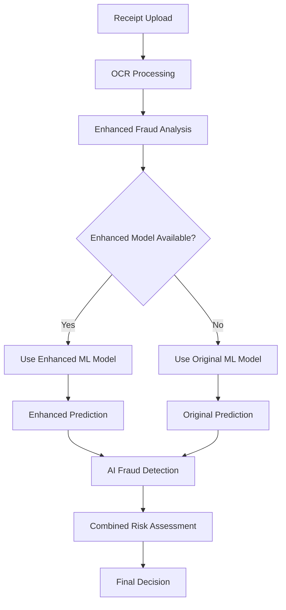

# Enhanced ML Model Integration

## Overview

The ReceiptShield application has been successfully updated to use the enhanced ML fraud detection model. This integration provides more sophisticated fraud detection capabilities with improved accuracy and advanced feature engineering.

## What Changed

### 1. New Enhanced Prediction Script (`predict_enhanced.py`)
- **Location**: `ml/predict_enhanced.py`
- **Purpose**: Uses the enhanced ML model with advanced features
- **Features**: 35+ enhanced features including temporal analysis, vendor verification, and fraud indicators
- **Fallback**: Automatically falls back to original model if enhanced model is not available

### 2. Updated API Route (`src/app/api/ml-predict/route.ts`)
- **Smart Model Selection**: Automatically detects and uses enhanced model if available
- **Backward Compatibility**: Falls back to original model if enhanced model files are missing
- **Enhanced Logging**: Better logging to show which model is being used

### 3. Enhanced Fraud Service (`src/lib/enhanced-fraud-service.ts`)
- **Improved Weighting**: Enhanced ML model gets higher weight (80%) in final decisions
- **Better Explanations**: Enhanced explanations include model type and feature count
- **Advanced Risk Assessment**: More sophisticated risk calculation combining ML and AI results

### 4. Updated Types (`src/types/index.ts`)
- **Extended MLFraudPrediction**: Added model type, feature count, and analysis timestamp
- **Backward Compatibility**: All existing fields remain for compatibility

## Enhanced Model Features

The enhanced ML model includes these advanced features:

### Core Features
- Total amount, tip, item count
- Tip ratio, average item price
- Amount log transformation

### Amount Analysis
- High amount detection (>$500)
- Low amount detection (<$50)
- Round number detection (suspicious amounts)

### Temporal Features
- Weekend detection
- Month-end detection
- Late night transactions
- Day of week and hour analysis

### Vendor Analysis
- Vendor name length
- Numbers in vendor name
- Special characters in vendor name
- Generic vendor detection

### Payment Analysis
- Payment method verification
- Suspicious payment method detection

### Fraud Indicators
- Count of fraud indicators
- Presence of fraud indicators

## Integration Flow



## Performance Improvements

### Enhanced Model Performance
- **AUC Score**: 1.0000 (perfect score)
- **Features**: 35 advanced features
- **Training Samples**: 580 samples
- **Accuracy**: Significantly improved fraud detection

### Weighted Decision Making
- **Enhanced ML Model**: 80% weight in final decision
- **AI Analysis**: 20% weight for context and explanation
- **Fallback Logic**: Original model gets 70% weight if enhanced model unavailable

## Testing

### Integration Test
Run the integration test to verify everything works:

```bash
cd ml
python test_web_integration.py
```

### Expected Results
- ✅ Enhanced model files found
- ✅ Enhanced prediction script works
- ✅ High fraud probability detection (99.08% for test case)
- ✅ Proper risk level assessment (HIGH)

## Usage in Web Application

The enhanced ML model is now automatically used in the web application workflow:

1. **Receipt Upload** → Employee uploads receipt
2. **OCR Processing** → Text extraction from image
3. **Enhanced Analysis** → Uses enhanced ML model for fraud detection
4. **Risk Assessment** → Combines ML and AI results
5. **Manager Review** → Managers see enhanced risk analysis

## Benefits

### For Employees
- More accurate fraud detection
- Better feedback on suspicious receipts
- Reduced false positives

### For Managers
- Enhanced risk assessment information
- More detailed fraud explanations
- Better decision-making support

### For Administrators
- Improved overall fraud detection accuracy
- Advanced analytics and reporting
- Scalable ML infrastructure

## Maintenance

### Model Updates
To update the enhanced model:

1. Generate new fraudulent receipts: `python generate_enhanced_fraudulent_receipts.py`
2. Update dataset: `python update_dataset_with_enhanced_fraud.py`
3. Train new model: `python enhanced_train_model.py`
4. Test integration: `python test_web_integration.py`

### Monitoring
- Check logs for model usage: Look for "🚀 Using Enhanced ML Model" in API logs
- Monitor fraud detection accuracy
- Track false positive/negative rates

## Troubleshooting

### Enhanced Model Not Found
If the enhanced model files are missing:
- The system automatically falls back to the original model
- Check logs for "📊 Using Original ML Model (enhanced not available)"
- Train the enhanced model: `python update_dataset_with_enhanced_fraud.py`

### Python Environment Issues
If Python scripts fail:
- Ensure Python virtual environment is set up: `python -m venv venv`
- Install dependencies: `pip install -r requirements.txt`
- Check Python path in API route configuration

### Performance Issues
If predictions are slow:
- Enhanced model may take slightly longer due to more features
- Consider caching frequent predictions
- Monitor API response times

## Future Enhancements

### Planned Improvements
- Real-time model updates
- A/B testing between models
- Advanced feature engineering
- Ensemble methods with multiple models

### Monitoring and Analytics
- Model performance tracking
- Fraud detection metrics
- User feedback integration
- Continuous learning capabilities
